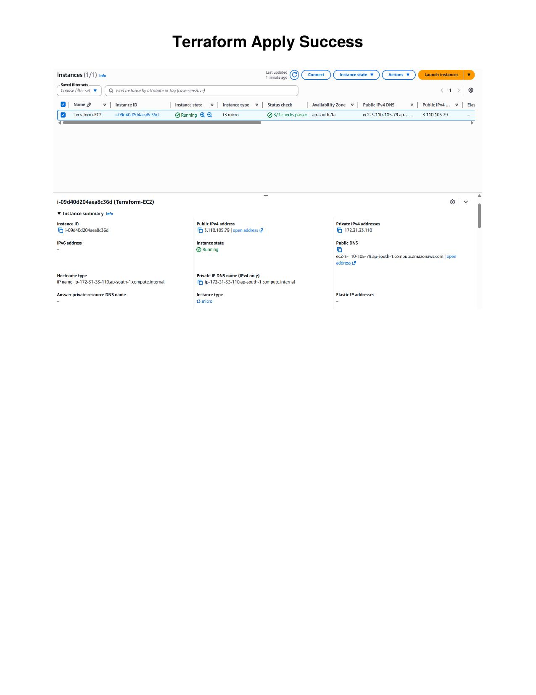
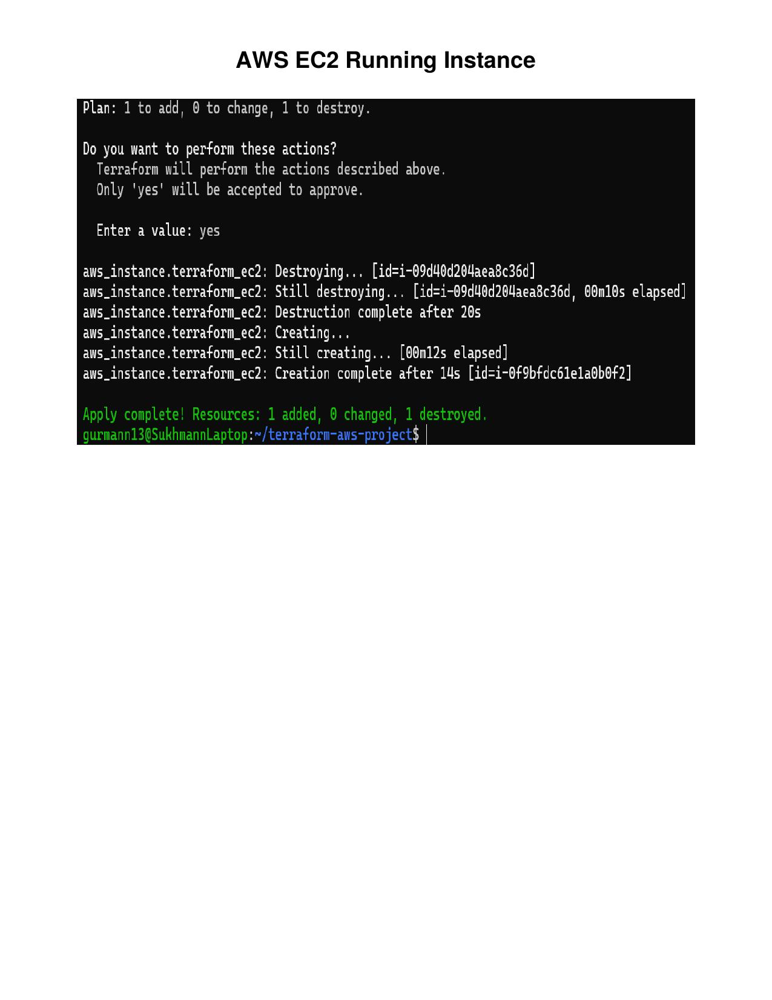
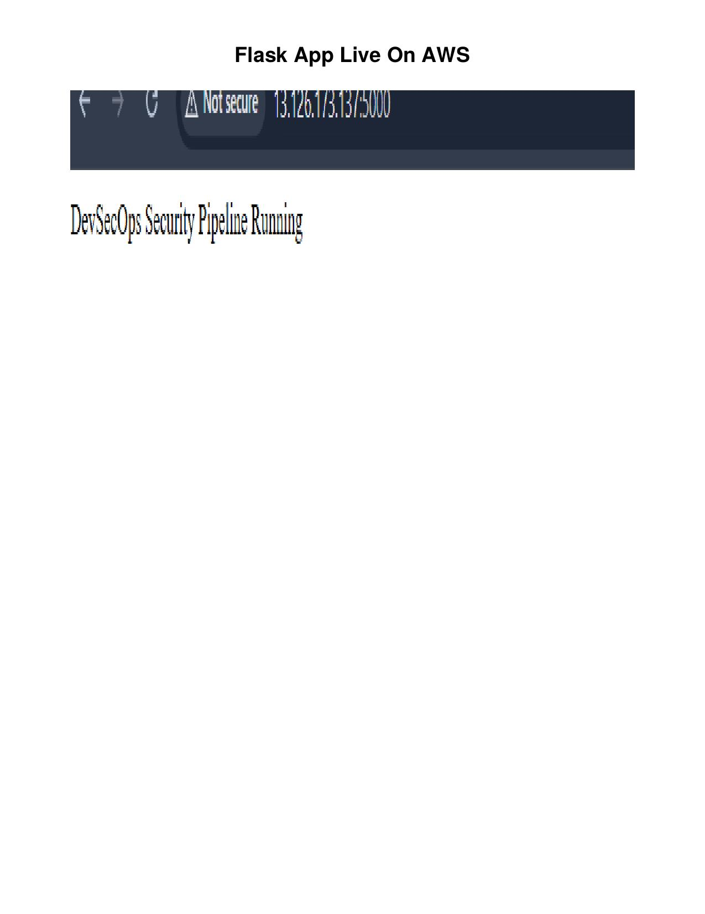

# 🌐 AWS Infrastructure Provisioning using Terraform


---

## Why I built this

After building CI/CD pipelines locally, I wanted to take the next step — deploying to actual cloud infrastructure. I used Terraform to provision AWS EC2 from scratch, configured security groups, set up SSH access, and deployed a Dockerized Flask app from Docker Hub onto the instance.

The goal was simple: write infrastructure as code, provision it, deploy on it, then destroy it cleanly. No clicking around in AWS console — everything through code.

---

## What it does

- Provisions an AWS EC2 instance using Terraform
- Configures security groups for ports 22 (SSH) and 5000 (Flask app)
- Sets up secure SSH access using PEM key pairs
- Deploys a Dockerized Flask application from Docker Hub onto EC2
- Manages full infrastructure lifecycle — init, plan, apply, destroy

---

## Stack

- **Terraform** — Infrastructure as Code
- **AWS EC2** — cloud compute instance (t3.micro)
- **IAM & Security Groups** — access control and port management
- **Docker Hub** — container image registry
- **Python / Flask** — application deployed on EC2
- **Linux / Ubuntu** — OS on EC2 instance

---

## Screenshots

### Terraform Apply — EC2 Created Successfully
*Resources provisioned — Creation complete after 14s*



---

### AWS EC2 Instance Running
*Instance in running state — 3/3 checks passed, public IP assigned*



---

### Flask App Live on AWS EC2
*App accessible on EC2 public IP at port 5000*



---

## Project Structure

```
terraform-aws-infrastructure/
├── main.tf              # Terraform configuration — EC2, security groups, key pair
├── terraform_apply-1.jpg
├── ec2_running-1.jpg
├── flask_live-1.jpg
└── README.md
```

---

## What I'd add next

- Use Terraform variables and tfvars for cleaner config
- Add S3 backend for remote Terraform state management
- Automate Docker deployment on EC2 using user_data scripts
- Add monitoring using CloudWatch

---

**Gurmann Singh Dhillon** — gurmanndhillon84@gmail.com — [github.com/Gurmann11](https://github.com/Gurmann11) — [linkedin.com/in/gurmanndhillon](https://linkedin.com/in/gurmanndhillon)
